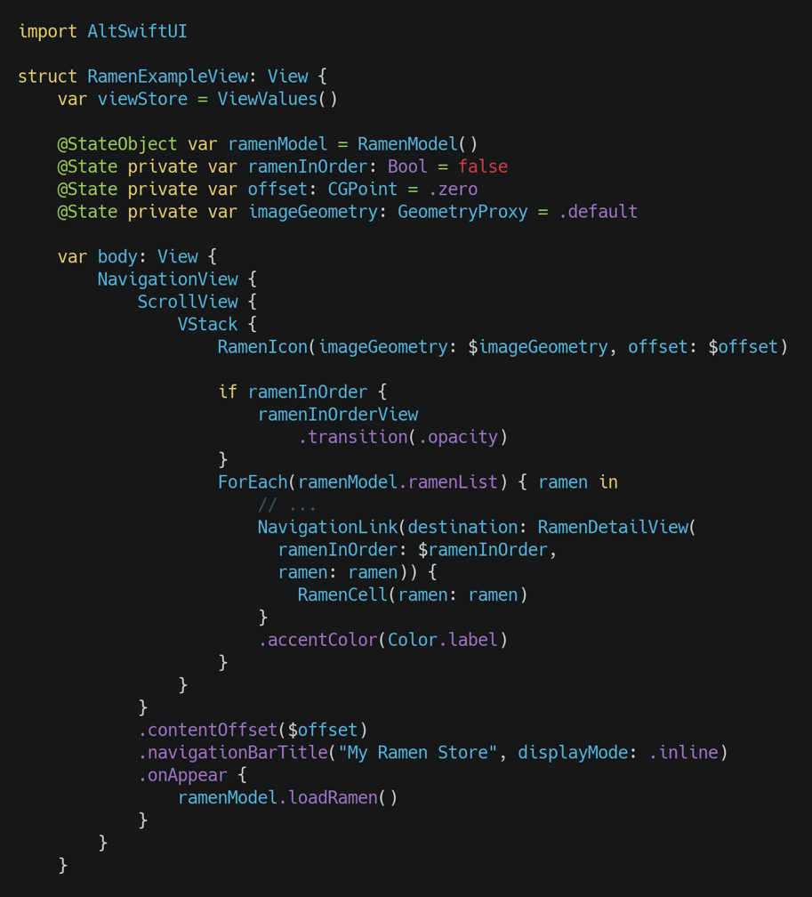
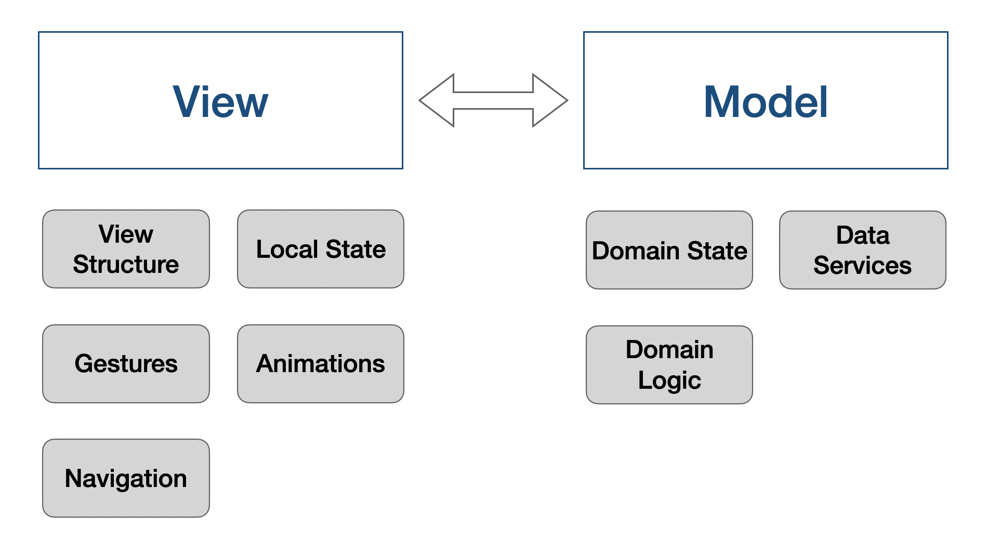

SwiftUI, introduced by Apple in 2019, allows developers to create apps with declarative UI programming and state management, which greatly helps to improve development speed and quality. However, the framework is locked at the iOS 13 SDK, and every new improvement iteration to this new framework will push up this restriction to the latest SDK (iOS 14, and so on).

AltSwiftUI is an open source UI framework for iOS that mimics SwiftUI’s interface, introducing a single OS baseline at iOS 11 and greater flexibility because of its open source nature.

Starting to use AltSwiftUI is pretty straightforward, just import it through Cocoa pods or Swift Package Manager. If you are familiar with SwiftUI syntax, then you are good to go.

For more info see: https://github.com/rakutentech/AltSwiftUI

## A peak into code

Other than some small differences, the code structure is highly similar to that of regular SwiftUI code. Of the main things we can point out, AltSwiftUI doesn't use associated types in views, meaning that is not necessary to use opaque return types (`some View`).

## Extended features

Even though AltSwiftUI has a very similar interface and features compared to SwiftUI, because we needed more features and capabilities than originally offered in order to develop iOS apps, AltSwiftUI introduces extra functionalities.

For example, we needed deeper integrations with List and ScrollView interactions, so there are methods like `ScrollView.scrollOffset` and `List.onDragStarted`. There are also multiple small additions to some of the views and modifiers, and this list will keep growing in the future. To identify these features, you can read the source documentation during development or at https://altswiftui.com.

## AltSwiftUI in Rakuten Travel

AltSwiftUI’s development started at the end of 2019, with the main purpose of taking on new projects while renewing the way we design software, improve the speed and quality of our development, and be more futureproof. During this journey, we tackled multiple challenges by comparing what SwiftUI originally offers with what our app needed, and the open source nature of this framework allowed us to improve it by adding features that would allow us to meet our app expectations. 

_Rakuten Travel Premium Club_ is an invitation only app built with AltSwiftUI.

### Simplified Architecture

One of the pillars that gave us a strong advantage in terms of design and development, is the ability to simplify our app’s architecture. In contrast to using design patterns such as MVVM or VIPER, which usually tend to increase the number of things a developer needs to worry about, we could transition to a MV (model view) design with AltSwiftUI at its core. 

The core principles of this MV design is that developers should focus more on what they want to build, rather than how. By clearly delimiting what is part of the UI (view layer) and what is part of our business logic/data (model layer), we were able to also easily visualize our tasks and improve development efficiency.

The view layer consists of components that interact with the user. This includes the actual view structure, its local state, navigation, gestures, animations, and so on. We define all of this in a single layer by the use of declarative programming.

The model layer consists of operations that retrieve, process and store data that are part of our business domain. At the same time, it exposes this data to the view layer as transparently as possible for a simple and smooth integration.

The framework’s ability to integrate view state with data, including automatic updates, is what allow us to remove intermediate layers that introduce complexity and would often be the cause of bugs. Instead, the framework handles these intermediate layers without needing to add extra code.

---

These are the good and the bad from choosing this approach:

__Pros__

- Once we got used to it, our development speed increased drastically.
- We could more easily improve our app visuals and interactions.
- We could make changes on demand in AltSwiftUI depending on the app needs, without needing to worry about OS deployment version.
- It became easier to request UI improvements to other developers during peer review and testing due to simpler code.
- We could adventure with more ease of mind to prototype new and original features.

__Cons__

- Continuously work to improve AltSwiftUI on top of our regular tasks demanded effort from our part (specially at the start of the framework's development).
- It required our developers to learn the combined features of SwiftUI and AltSwiftUI.

It’s hard to tell what will happen in the future some years from now. By working with the same design philosophy that accompanies the emerging SwiftUI framework, and also an extremely similar code structure, we improve our chances for any future transition to be less costly and smoother.

## AltSwiftUI’s future

Following the project’s roadmap, our goal is for the framework to get new components as they are released in SwiftUI, as well as keep getting new extra features for better quality of life. At the same time, we would like this framework to serve as a transition bridge for projects that plan to use SwiftUI in the future.