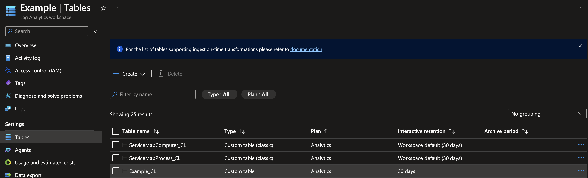

To collect custom log files from a VM (Virtual Machine) managed by Azure, it is recommended to use Azure Monitor and the Azure Monitor Agent (AMA). The Azure Monitor Agent is the successor to the Log Analytics Agent which is due to be deprecated on August 31, 2024. There are currently issues associated with the azurerm provider in relation to Azure Monitor.

I suspect in the future these issues will be addressed with updates but for now this post will serve to provide a workaround along with an explanation as to what these are.

Below are links to some of the capabilities discussed in this article:

* [Azure Log Analytics](https://learn.microsoft.com/en-us/azure/azure-monitor/logs/log-analytics-overview)
* [Azure Monitor](https://learn.microsoft.com/en-us/azure/azure-monitor/overview)
* [Azure Monitor Agent](https://learn.microsoft.com/en-us/azure/azure-monitor/agents/agents-overview)
* [Terraform AzureRM provider](https://registry.terraform.io/providers/hashicorp/azurerm/latest/docs)

**AzureRM version 3.74.0**

## The issue

Currently the advised method of collecting logs and storing them with Azure Monitor relies on the following configuration:

* Setup a Log Analytics Workspace
* Create a Log Analytics Workspace Table for storing logs
* Install the correct agents on the VM
* Setup a Data Collection Rule (DCR)
* Setup a Data Collection Endpoint
* Create a Data Collection Association between the Data Collection Rule and the VM

The issue here pertains to the Log Analytics Workspace Table. According to the Azure documentation, it advises that a table be created in the Log Analytics Workspace to store the custom logs. Using the AzureRM provider, It is implied that when creating the DCR and setting up the stream declaration that it will create the table in the Log Analytics Workspace, however this does not seem to be the case. Previously developers were able to create the table when setting up the Log Analytics Workspace.

```hcl
resource "azurerm_resource_group" "example" {
  name     = "example-resources"
  location = "West Europe"
}

resource "azurerm_log_analytics_workspace" "example" {
  name                = "acctest-01"
  location            = azurerm_resource_group.example.location
  resource_group_name = azurerm_resource_group.example.name
  sku                 = "PerGB2018"
  retention_in_days   = 30
}

resource "azurerm_log_analytics_workspace_table" "container_logs" {
  name         = "ContainerLog"
  workspace_id = azurerm_log_analytics_workspace.example.id

  plan              = "Basic" # or "Analytics"
  retention_in_days = 7 # per docs, setting to null defaults to workspace default
}
```

The resource `azurerm_log_analytics_workspace_table` has since been deprecated. Currently there is no way to create the Log Analytics Workspace Table using the azurerm provider.

## The Workaround

This is done by using the AzAPI to create the Log Analytics Workspace Table. The schema of the table should match the format of your logs.

To enable the AzAPI you have to include it in your terraform configuration as follows:

```hcl
terraform {
required_providers {
    azapi = {
      source  = "Azure/azapi"
      version = "~> 1.8.0"
    }
  }
}
resource "azapi_resource" "data_collection_logs_table" {
  name      = "Example_CL"
  parent_id = azurerm_log_analytics_workspace.example.id
  type      = "Microsoft.OperationalInsights/workspaces/tables@2022-10-01"
  body = jsonencode(
    {
      "properties" : {
        "schema" : {
          "name" : "Example_CL",
          "columns" : [
            {
              "name" : "TimeGenerated",
              "type" : "datetime",
              "description" : "The time at which the data was generated"
            },
            {
              "name" : "Level",
              "type" : "string",
              "description" : "Log level"
            },
            {
              "name" : "Logger",
              "type" : "string",
              "description" : "Logger name"
            },
            {
              "name" : "Context",
              "type" : "string",
              "description" : "Context of the log line"
            },
            {
              "name" : "Message",
              "type" : "string",
              "description" : "Log message"
            },
            {
              "name" : "AdditionalContext",
              "type" : "string",
              "description" : "Additional context of the log line"
            }
          ]
        },
        "retentionInDays" : 30,
        "totalRetentionInDays" : 30
      }
    }
  )
}
```

This HCL block will create the table in the associated Log Analytics Workspace using the defined schema. Details of schema options can be found in the documentation.

The documentation for this can be found [here](https://learn.microsoft.com/en-us/azure/templates/microsoft.operationalinsights/workspaces/tables?pivots=deployment-language-bicep).


The next step will be to configure the Data Collection Rule (DCR)

```hcl
resource "azurerm_monitor_data_collection_rule" "example" {
  name                        = "dcr-example"
  resource_group_name         = azurerm_resource_group.example.name
  location                    = azurerm_resource_group.example.location
  data_collection_endpoint_id = azurerm_monitor_data_collection_endpoint.example.id


  data_sources {
    log_file {
      name          = "example-logfile"
      format        = "text"
      streams       = ["Custom-${azapi_resource.data_collection_logs_table.name}"]
      file_patterns = ["/var/log/example/*.log"]
      settings {
        text {
          record_start_timestamp_format = "ISO 8601"
        }
      }
    }
  }
  destinations {
    log_analytics {
      name                  = local.log_analytics_destination
      workspace_resource_id = azurerm_log_analytics_workspace.example.id
    }
  }
  data_flow {
    streams       = ["Custom-${azapi_resource.data_collection_logs_table.name}"]
    destinations  = [local.log_analytics_destination]
    output_stream = "Custom-${azapi_resource.data_collection_logs_table.name}"
  }
  stream_declaration {
    stream_name = "Custom-${azapi_resource.data_collection_logs_table.name}"
    column {
      name = "TimeGenerated"
      type = "datetime"
    }
    column {
      name = "Level"
      type = "string"
    }
    column {
      name = "Logger"
      type = "string"
    }
    column {
      name = "Context"
      type = "string"
    }
    column {
      name = "Message"
      type = "string"
    }
    column {
      name = "AdditionalContext"
      type = "string"
    }
  }
}
```

This HCL block will setup the Data Collection Rule. The DCR stream declaration should mirror the schema used the AzAPI resource block used for creating the Log Analytics Workspace Table. The final resources that your configuration should have is:

* Log Analytics Workspace
* Data Collection Endpoint
* Azure Monitor Agent Extension
* Data Collection Rule Association

```hcl
resource "azurerm_log_analytics_workspace" "example" {
  name                = "example"
  location            = azurerm_resource_group.example.location
  resource_group_name = azurerm_resource_group.example.name
  sku                 = "PerGB2018"
  retention_in_days   = 30
}

resource "azurerm_monitor_data_collection_endpoint" "example" {
  name                          = "mdce"
  resource_group_name           = azurerm_resource_group.example.name
  location                      = azurerm_resource_group.example.location
  kind                          = "Linux"
}

resource "azurerm_virtual_machine_extension" "ama" {
  name                       = "AzureMonitorLinuxAgent"
  virtual_machine_id         = azurerm_virtual_machine.example.id
  publisher                  = "Microsoft.Azure.Monitor"
  type                       = "AzureMonitorLinuxAgent"
  type_handler_version       = "1.0"
}

resource "azurerm_monitor_data_collection_rule_association" "dcr" {
  name                    = "dcr"
  target_resource_id      = azurerm_virtual_machine.example.id
  data_collection_rule_id = azurerm_monitor_data_collection_rule.example.id
}
```

Once you’ve applied out your terraform configuration you can view the table via your Log Analytics Workspace.



As stated before, this problem should be fixed in a future version of the AzureRM provider but for now I hope it helps someone out!
