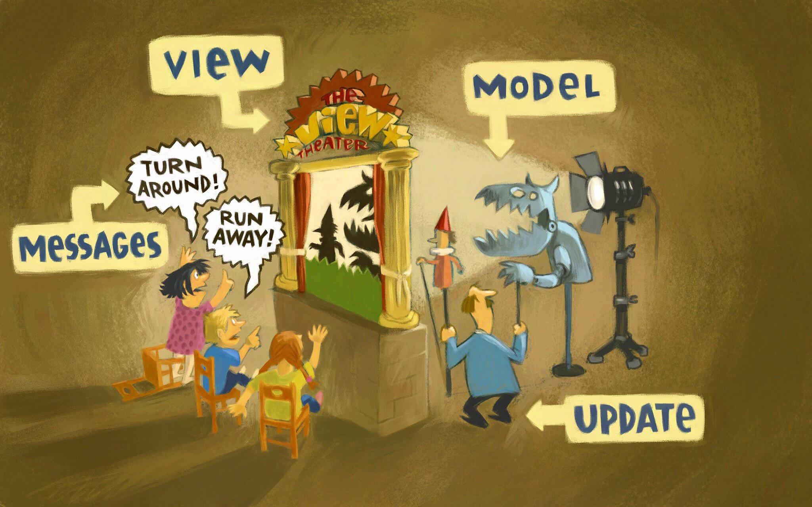
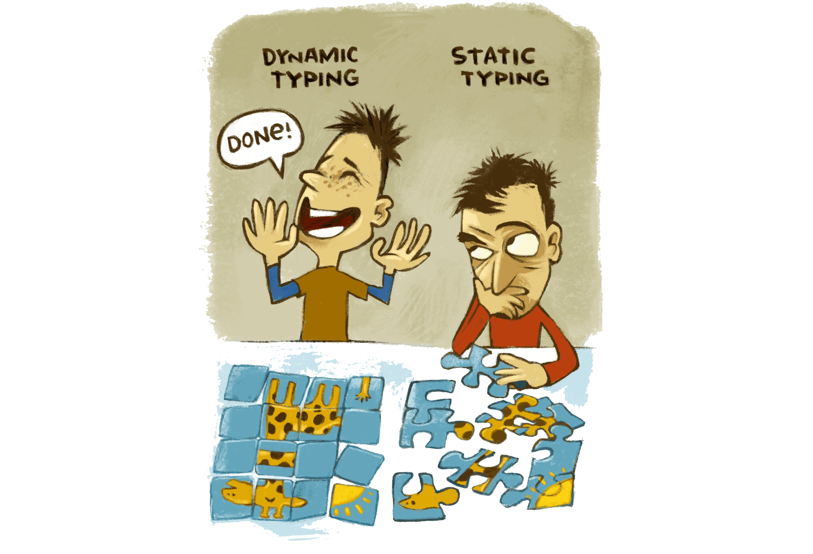
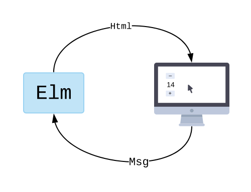
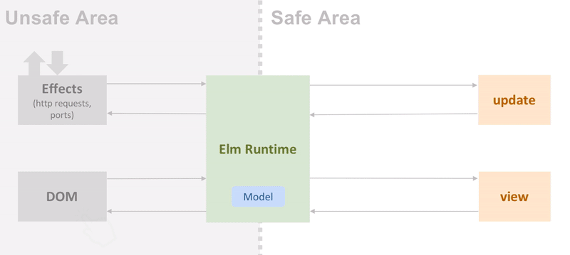
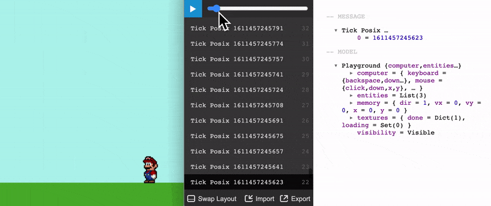

In our team at Rakuten, **we have been using Elm[^elm] in production for almost two years now**. This post is about our story, the lessons we learned, and our likes and dislikes.

This post is quite long so if you prefer to see an overview, feel free to [jump to the index](#index).

[^elm]: **Elm** is a **compiled, immutable, strongly statically typed, and purely functional** programming language that compiles to JavaScript. JavaScript is a **just-in-time compiled, weakly dynamically typed, multi-paradigm** programming language. To know more about Elm, a good start is the [official guide](https://guide.elm-lang.org/). If you are familiar with JavaScript you can check [From JavaScript?](https://elm-lang.org/docs/from-javascript) which is a short comparison between the syntax of the two languages. The Elm language, including the compiler and the core libraries, is designed and developed by Evan Czaplicki, with the support of a small core team of developers. Evan retains the final say in disputes or arguments. This setup, a common practice for the initial few years of many languages, guarantees a coherent vision and well-designed APIs.

Everything started in the Berlin branch of Rakuten during the summer of 2017. We were maintaining a medium-size single-page application written in Vanilla JavaScript when things started going out of control.

> “Our JavaScript application had global variables everywhere, and debugging was a nightmare.”

Fixing something in one place would break the code in several other locations. We had global variables everywhere, and debugging was a nightmare.

We decided to impose some discipline and start rewriting functions in a _pure style_[^pure-style] to regain some control over our application. The code was getting better, more self-contained, and simpler to understand.

[^pure-style]: [Pure functions](https://en.wikipedia.org/wiki/Pure_function) are those functions where the output only depends on the input and don’t have any side effects.

We were thinking: _“if we only could find a tool to enforce these rules so we wouldn’t have to rely on our self-discipline...”_ and then we came across the post _"Introduction to The Elm Architecture and How to Build our First Application"_[^css-tricks] published in the website css-tricks.com. It was love at first sight.

[^css-tricks]: The [Introduction to The Elm Architecture and How to Build our First Application](https://css-tricks.com/introduction-elm-architecture-build-first-application/) by James Kolce was the second part of a three-part series published on the [CSS-Tricks](https://css-tricks.com/) website in 2017.

> "A delightful language with no runtime exceptions."
>
> **-- The Elm website [^elm-website]**

[^elm-website]: The [Elm website](https://elm-lang.org/) is the main source of information and documentation to start with Elm. A quote about **runtime errors** from the site: "_Elm uses type inference to detect corner cases and give friendly hints. NoRedInk switched to Elm about two years ago, and 250k+ lines later, they still have not had to scramble to fix a confusing runtime exception in production._"

Elm was promising that **all of our functions would be pure** by design and that there would be **no errors at runtime**[^errors-at-runtime] anymore.

[^errors-at-runtime]: In the front-end, **errors at runtime** are errors that happen in the browser. These errors can completely halt the functionality of the website and you, as the creator, may not even know about them because they are happening on other peoples' devices. Some tools allow you to get notified when these errors happen. These errors are usually JavaScript errors, for example, trying to access values that are null or undefined.

Moreover, **The Elm Architecture**, included in the Elm language, **seemed an excellent way to structure an application**. It ended up being one of the most influential Elm ideas in the front-end world, more about this later.


_The Elm Architecture, illustration by [Kolja Wilcke](https://twitter.com/01k), licensed under [CC BY 4.0](https://creativecommons.org/licenses/by/4.0/)._

So, we started learning Elm by building some prototypes, and the first results were promising. But the technology stack was still heavily server-side based, mostly PHP, and the adoption was proceeding slowly.

### 🕒 　 One year later

Fast forward one year (and move 9,000 kilometers to the right), and in the headquarters of Rakuten, in Tokyo, there was an environment where Elm would have taken root successfully.

Several engineers were already pushing for a more functional-style way of writing code, and in a department heavily based on back-end APIs, there was a strong need for a decoupled way to write user interfaces.

### 🕒 　 Two years later

Fast forward another couple of years, and here we are, with **several applications in production built with Elm for a total of ~100k lines of code**.[^oslo-elm-days]

[^oslo-elm-days]: Even if it is almost two years old now, some more details about the use of Elm at Rakuten can be found in my talk [Elm at large (companies)](https://youtu.be/yH6o322S8XQ) given at the **Oslo Elm Day 2019** conference.

These are some of our public projects made in Elm: A highly-customizable authentication and registration system used across different Rakuten services (for example [Rakuten Taiwan](https://login.account.rakuten.com/sso/register?client_id=rakuten_tw01&redirect_uri=https%3A%2F%2Fwww.rakuten.com.tw%2Fmember%2Fdelegate&response_type=code&scope=openid+profile+email&ui_locales=en-UK#/registration/1) and [Rakuten Sport](https://login.account.rakuten.com/sso/register?client_id=rakuten_sports&redirect_uri=https%3A%2F%2Fsports.rakuten.com%2F&response_type=code&scope=openid%2Bemail%2Bprofile&ui_locales=en-UK#/sign_in)) with different user journey requirements, a [UI library](https://package.elm-lang.org/packages/rakutentech/r10/latest/) to build [stuff like this](https://ellie-app.com/dYydQR9MxNwa1), an [HTTP library](https://rakutentech.github.io/http-trinity/), the [Rakuten Open Source website](https://rakutentech.github.io/) ([source code](https://github.com/rakutentech/rakutentech.github.io)), a simple — but infinitely cute! — [404 error page](https://login.account.rakuten.com/), an [informative page about security](https://static.id.rakuten.co.jp/static/about_security/jpn/) (in Japanese).


_[Example of a credit card form](https://r10.netlify.app/form_example_credit_card/) made using the R10 library._

---

# Index

- [Top](#top)

### What we like about Elm

In no particular order.

1. [Guarantees](#1-guarantees)
1. [Controlled state](#2-controlled-state)
1. [Principle of least astonishment](#3-principle-of-least-astonishment)
1. [“Making impossible states impossible”](#4-making-impossible-states-impossible)
1. [One way of doing things](#5-one-way-of-doing-things)
1. [Stability](#6-stability)
1. [Functional programming](#7-functional-programming)
1. [Enforced discipline](#8-enforced-discipline)
1. [Learnability](#9-learnability)
1. [Compiler as assistant](#10-compiler-as-assistant)
1. [Elm as an influencer](#11-elm-as-an-influencer)
1. [The Elm Architecture](#12-the-elm-architecture)
1. [The Elm debugger](#13-the-elm-debugger)
1. [Elm-UI, the alternative to CSS/HTML](#14-elmui-the-alternative-to-csshtml)
1. [Readability and Elm syntax](#15-readability-and-elm-syntax)
1. [Refactoring](#16-refactoring)
1. [Hiring](#17-hiring)
1. [Fast performance and small assets](#18-fast-performance-and-small-assets)
1. [Content-driven static websites](#19-contentdriven-static-websites)

### What we don't like about Elm

In no particular order.

1. [Not mainstream](#1-not-mainstream)
1. [Lack of googleable resources](#2-lack-of-googleable-resources)
1. [Reinventing the wheel](#3-reinventing-the-wheel)
1. [Mindset shift](#4-mindset-shift)
1. [Some JavaScript and CSS are still necessary](#5-some-javascript-and-css-are-still-necessary)

- [Conclusion](#conclusion)
- [Other testimonies](#other-testimonies)

---

# What we like about Elm

---

## 1. Guarantees

These are probably the most objective and important guarantees that Elm provides and that are difficult (impossible?) to find in other frameworks.

- ⛔ No runtime exceptions.
- 🗿 100% immutable data.
- 💧 100% pure functions, also in all dependencies.
- ♻️ 100% type inference.

There are tradeoffs when choices, like these above, are made. For example, is not possible to call a JavaScript function directly from Elm. If that is of paramount importance for you, Elm is not the right choice.

If instead, you think that Elm guarantees are more important, then Elm is the right choice.

In the section _The Limits of Elm/JS Interop_ of the Elm guide, Evan Czaplicki elaborates more on this concept.[^limits-of-interop]

[^limits-of-interop]: In this [section of the Elm guide](https://guide.elm-lang.org/interop/limits.html), Evan Czaplicki explains what are the tradeoffs of Elm guarantees.

[Index](#index) | [Top](#top)

---

## 2. Controlled state

JavaScript lets us do what we want with the state of a program. This can be useful for a quick prototype, but it is the precursor of bugs because it is difficult to track and understand changes in global variables.

> “A large fraction of the flaws in software development are due to programmers not fully understanding all the possible states their code may execute in”
>
> **-- John Carmack [^carmack-on-state]**

[^carmack-on-state]: A quote from an in-depth piece by **John Carmack** that looks at [the value of using functional-style programming with C++](https://www.gamasutra.com/view/news/169296/Indepth_Functional_programming_in_C.php). John Carmack is an independent AI researcher, consultant CTO at **Oculus VR**, and founder of **Armadillo Aerospace** and **Id Software**, where he was the lead programmer of the games **Commander Keen**, **Wolfenstein 3D**, **Doom**, and **Quake**.

**All functions in Elm must be pure**, so they cannot hold any state, and **all data must be immutable**. The entire state of your application needs to be stored in one place, by design, making your **application simpler to comprehend and easier to debug**.

The place where the state is, in Elm, is the `Model` and it is managed by the _Elm Runtime system_[^elm-runtime-system] so that 100% of the code that we write can be pure (these concepts will be explained in more detail later).

[^elm-runtime-system]: The [Elm runtime system](https://guide.elm-lang.org/effects/) is the part of the code in charge of directing the application. For example, it figures out how to render HTML, how to send an HTTP request, redirect users' clicks back into the Elm code, etc.

[Index](#index) | [Top](#top)

---

## 3. Principle of least astonishment

One of the ideas of Elm is that the outcome of the code should be predictable, without surprises.[^pola] For example:

[^pola]: The [Principle of Least Astonishment](https://wiki.c2.com/?PrincipleOfLeastAstonishment#:~:text=The%20Principle%20of%20Least%20Astonishment,the%20operation%20and%20other%20clues.&text=In%20addition%20to%20function%20naming,applies%20to%20user%20interface%20design.) states that the result of performing some operation should be **obvious**, **consistent**, and **predictable**, based upon the name of the operation and other clues.

- The **Elm static type system**, discussed in detail below, removes a whole category of surprises related to dynamic typing.
- The Elm Package Manager supports **Enforced Semantic Versioning**.[^semantic-versioning] There are no surprises in PATCH releases because version numbers are enforced by a script that scans libraries detecting, for example, removal or renaming of exposed functions.
- **Elm-UI**, a library to render views that translate developers' intents into layouts in a clear manner, discussed in detail later.

[^semantic-versioning]: The Elm Package Manager allows you to check differences (functions added/removed/modified) in any published Elm package simply by running the command `elm diff` like in `elm diff elm/json 1.0.0 1.1.2`. Evan Czaplicki gives a live example of this feature in the video [Convergent Evolution](https://youtu.be/jl1tGiUiTtI).

Languages with **automatic type conversion** (also called **implicit type casting**), like JavaScript, can lead to surprises.[^funny-youtube-videos] What happens if we add a _number_ and a _string_ together? For example, `1` and `"2"`? Do we get `3`? Do we get `"12"`? Do we get an error? Do we get something else?

[^funny-youtube-videos]: There are several funny videos about this topic on YouTube. One of the most popular is probably [What the... JavaScript?](https://youtu.be/2pL28CcEijU) by Kyle Simpsons

Elm, in contrast, is strongly and statically typed so cases like the one mentioned above are not possible.[^implicit-casts] It is not even necessary to add _types annotations_[^type-annotations] because types are inferred by the Elm compiler. The type inference covers 100% of the code, including all external libraries.

[^implicit-casts]: Note that Elm requires explicit conversion between _integers_ and _floating_ numbers. Someone find this cumbersome. This explicit conversion is necessary to make the Elm compiler faster. You can read more about this in the [Implicit Casts](https://github.com/elm/compiler/blob/master/hints/implicit-casts.md) article.
[^type-annotations]: Type annotations in Elm are not required but are considered good practice to add them. It helps the compiler to provide more precise errors and also to detect bugs, like in the case of [Infinite Types](https://github.com/elm/compiler/blob/master/hints/infinite-type.md).


_Dynamic Typing vs Static Typing, illustration by [Kolja Wilcke](https://twitter.com/01k), licensed under [CC BY 4.0](https://creativecommons.org/licenses/by/4.0/)._

If you need to create a quick proof of concept, dynamic typing may be faster and the puzzle does resemble a giraffe even if it contains mistakes. But for robust applications and correct puzzle solutions, static typing is the right way to go.

TypeScript, which adds optional static typing to JavaScript and is probably one of the best things to happen to JavaScript, can partially mitigate the issues with the JavaScript dynamic type system. But being a superset of JavaScript it needs to compromise on elegance and simplicity. It also has several "blind spots".[^blind-spots] For example, type declarations are optional (_any_ as escape hatch), inference doesn’t cover all the code, it requires _type guards_,[^type-guards] JSON data is not type-checked, and not all JavaScript libraries have type annotations.

[^blind-spots]: The article [TypeScript's Blind Spots](https://incrementalelm.com/typescript-blind-spots/) by Dillon Kearns illustrates several weak points of TypeScript.
[^type-guards]:
    [Type guards](https://www.typescriptlang.org/docs/handbook/advanced-types.html) are TypeScript expressions that perform a runtime check to discriminate between _custom types_. For example:function isFish(pet: Fish | Bird): pet is Fish {
    return (pet as Fish).swim !== undefined;
}After that is possible to write code like:if (isFish(pet)) {
    pet.swim();
} else {
    pet.fly();
}In Elm _type guards_ are not needed, it is possible to just directly use a [case .. of](https://guide.elm-lang.org/types/pattern_matching.html) constructcase pet of
    Fish fish -> fish.swim
    Bird bird -> bird.flyThe **case .. of** construct also guarantees that we are considering all possible custom types.

[Index](#index) | [Top](#top)

---

## 4. “Making impossible states impossible”


_Penrose Triangle.[^penrose-triangle]_

[^penrose-triangle]: The [Penrose Triangle](https://en.wikipedia.org/wiki/Penrose_triangle) is a triangular impossible object. Illustration made with Elm and [Elm-Playground](https://package.elm-lang.org/packages/evancz/elm-playground/latest/), [here the source code](https://ellie-app.com/bZVgZf8GJvja1).

The depth of the Elm type system allows us to model scenarios precisely, to **make impossible states impossible**.[^make-impossible-states-impossible] This is more a **coding pattern**[^coding-patterns] rather than a language feature, and it requires a fully-fledged type system to work.

[^make-impossible-states-impossible]: The concept of **making impossible states impossible** is well explained by [Richard Feldman in his homonymous talk at Elm-conf 2016](https://youtu.be/IcgmSRJHu_8).
[^coding-patterns]: These [coding patterns in Elm](https://sporto.github.io/elm-patterns/index.html) are considered good practice. [Making impossible states impossible](https://sporto.github.io/elm-patterns/basic/impossible-states.html) is one of them.

To clarify, let's make an example modeling the HTTP state with a **type alias**:[^type-alias]

[^type-alias]: A [`type alias`](https://guide.elm-lang.org/types/type_aliases.html) is a shorter name for a type.

```elm
type alias HttpState =
    { loading : Bool
    , error : Maybe String
    , success : Maybe String
    }
```

The **cardinality** (number of possible states) for this structure is 2 x 2 x 2 = 8 because both **Bool** and **Maybe**[^maybe] have cardinality = 2.

[^maybe]: The type [`Maybe`](https://guide.elm-lang.org/error_handling/maybe.html) is how Elm handles missing values because **null** or **undefined** don't exist. Maybe is defined as type Maybe a = Just a | Nothing The Elm compiler will refuse to compile until you handle all the cases where a value may be missing in your code.

But the possible states of the HTTP request are only three: `Loading`, `Error`, and `Success`. To make these extra five impossible states impossible, we can rewrite the code using a **custom type**:[^custom-type]

[^custom-type]: As Evan Czaplicki put it, “[Custom types are the most important feature in Elm](https://guide.elm-lang.org/types/custom_types.html)”.

```elm
type HttpState
    = Loading
    | Error String
    | Success String
```

_Custom types_ are also called _Sum types_ in the sense that the cardinality is now a sum: 1 + 1 + 1 = 3. The right number of possible states.

[Index](#index) | [Top](#top)

---

## 5. One way of doing things

One application of this principle[^python] is about finding the best solution to a problem and then enforcing it in the language.

[^python]: This principle is also mentioned in the [Zen of Python](https://en.wikipedia.org/wiki/Zen_of_Python): "There should be one — and preferably only one — obvious way to do it."

For example:

- **The adoption of The Elm Architecture** as the standard way to structure web applications
- The linter **Elm-Format is not configurable**. Therefore, all Elm code is formatted using the same style. The end of the tab vs. space war.

The principle guarantees consistency across codebases, even when they belong to different teams and organizations.

Other languages and frameworks follow different principles. For example, JavaScript follows the **“One JavaScript”** principle.[^one-javascript] It means that JavaScript is not versioned and is back compatible. Back-compatibility is the precursor of "several ways of doing things."

[^one-javascript]: The [One JavaScript](https://2ality.com/2014/12/one-javascript.html) principle is about removing versioning and being always back-compatible. This fact, combined with ten days of design and 25 years of back compatibility, inevitably accumulated a large number of different ways of doing things. For example, defining a function can be done in [several different ways](https://dmitripavlutin.com/6-ways-to-declare-javascript-functions/).

[Index](#index) | [Top](#top)

---

## 6. Stability

A lot of work has been done to improve the Elm compiler, but the language per se has not undergone any major updates in more than four years.[^stability] Moreover, no foreseeable updates are coming soon.[^roadmap] The latest versions were mainly about improvements of the compiler’s performances and removal of features that were considered unnecessary or even detrimental, like the infix operator.[^infix-operator]

[^stability]: The latest large change was the [Farewell to Functional Reactive Programming](https://elm-lang.org/news/farewell-to-frp) in May 2016. Here a [high-level picture of the updates](https://elm-lang.org/news).
[^roadmap]: [Evan Czaplicki's ideas about the future of Elm](https://github.com/elm/compiler/blob/master/roadmap.md).
[^infix-operator]: The infix operator has been removed because it was leading to unreadable code due to the creation of fancy non-standard operators. This is a longer explanation of [why the infix operators were removed](https://gist.github.com/evancz/769bba8abb9ddc3bf81d69fa80cc76b1).

And this is great because we can concentrate on building great products instead of spending time updating our code to the latest release.

> "It seems that perfection is attained not when there is nothing more to add, but when there is nothing more to remove"
>
> **-- Antoine de Saint Exupéry**

The core modules are also very stable. Most of the action nowadays is happening in non-core modules and toolings.[^action]

[^action]: The feed that shows all the [updates done on Elm packages](https://elm-greenwood.com/) is a good way to measure the activity that is happening on Elm libraries. Again, this activity should not be confused with the adoption of the language. Stable libraries tend not to be updated often. You will seldom see a core library in the feed. Sometimes there are complaints about lack of transparency about the work done on the compiler and core modules. [Elm does not follow the standard "open source" culture in certain ways](https://github.com/elm/expectations) and most of the core work is done on a private repository. If you are interested in supporting the language, the best way is by [getting involved in its community and contributing to the ecosystem](https://discourse.elm-lang.org/t/what-is-constructive-input/977).

We started writing Elm in version 0.18, and the transition to version 0.19[^version-0-19] was very smooth. We had more issues with the update of the HTTP library[^http-library-update] when, for lack of internal communication, one of our in-house dependencies was suddenly updated to HTTP 2.0, forcing us to refresh all the rest of the code in a short time.

[^version-0-19]: The [update from version 0.18 to version 0.19](https://elm-lang.org/news/small-assets-without-the-headache) was mainly about the optimization of the compiler.
[^http-library-update]: [The update of the HTTP library](https://github.com/elm/http/releases/tag/2.0.0) is probably the latest large update within the core modules.

[Index](#index) | [Top](#top)

---

## 7. Functional programming

Functional programming[^functional-programming] is on the rise again! Maybe we are already in the middle of a third paradigm shift.[^third-paradigm-shift]

[^functional-programming]:
    **Functional programming** is a programming paradigm where programs are constructed by applying and composing functions. It is a **declarative** programming paradigm based on a sequence of functions that only depend on each other in terms of arguments and return values. It looks something like this:func1 ( func2 ( func3 (...) ) )By contrast, the **procedural paradigm** is based on a sequence of **imperative** commands that may implicitly alter the shared state. It looks something like this:proc() {
    proc1();
    proc2();
    proc3();
}

[^third-paradigm-shift]: [From Object Orient to Functional Programming](https://youtu.be/6YbK8o9rZfI?t=67), talk by Richard Feldman about paradigm shifts.

> "No matter what language you work in, programming in a functional style provides benefits. You should do it whenever it is convenient, and you should think hard about the decision when it isn't convenient."
>
> **-- John Carmack [^carmack-on-fp]**

[^carmack-on-fp]: [In-depth: Functional programming in C++](https://www.gamasutra.com/view/news/169296/Indepth_Functional_programming_in_C.php) by John Carmack.

Functional programming is good at handling complexity using **function composition**, splitting difficult problems into manageable problems. Then the functions that solve these manageable problems are composed together to solve the original difficult problem.

Functions obtained with this process tend to be small, increasing their reusability, maintainability, and readability.

An interesting fact is that Elm is acting, for many developers, as a gateway to Functional Programming, as a pedagogical tool, because it is simpler to learn than other functional languages.

Recently several new functional programming languages have appeared: [Gleam](https://youtu.be/ceynSTa1dV4), [Unison](https://youtu.be/gCWtkvDQ2ZI), [Roc](https://youtu.be/ZnYa99QoznE?t=4765), [Koka](https://koka-lang.github.io/), [Formality](https://github.com/moonad/Formality).

It is an exciting moment for functional programming.

### Currying

Currying is a characteristic that is found in many functional languages. In Elm, all functions are curried by default. Currying means converting a function that takes multiple arguments into a sequence of functions that take a single argument:[^currying-in-javascript]

[^currying-in-javascript]:
    Out of curiosity, the closest equivalent in JavaScript of the Elm function add a b = a + b that also supports currying, is add = a => b => a + b // a => b => a + b
add(1)                // b => a + b
add(1)(2)             // 3 That is mostly syntactic sugar for function add(a) {
    return function(b) {
        return a + b;
    }
} To learn more about how _currying_ and how functions are defined in Elm, I recommend reading [Functions in Elm](https://gist.github.com/mauroc8/fdb9ac1e46639348549d1286215ee793).

```elm
add a b = a + b -- <function> : number -> number -> number
add 1           -- <function> : number -> number
add 1 2         -- 3 : number
```

The main advantage of currying is the increased flexibility in combining functions, like a puzzle game done with type signatures.[^partial-application] For example, if you need to add 10 to the items of a list, you can write, using the `add` function defined above:

```elm
List.map (add 10) [1, 2, 3] -- Gives [11,12,13]
```

[^partial-application]: Passing a smaller number of arguments to a function, like in `add 10`, is called **partial application** and it opens the door to interesting coding techniques. If you squint, it is like _dependency injection_ where the `10` is the injected part. Scott Wlaschin explains this and other patterns in his talk [Functional Design Patterns](https://youtu.be/srQt1NAHYC0?t=2077).

[Index](#index) | [Top](#top)

---

## 8. Enforced discipline

Purely functional languages motivate programmers to think better about the programs they are building. Although the initial development time can increase with such restrictions, the increased maintainability compensates for the effort.

Elm enforces discipline on developers rather than letting developers be disciplined on their own. This fact, in conjunction with other characteristics, makes Elm a good fit for large front-end teams.

> “Everything that is syntactically legal will eventually end up in your codebase”
>
> **-- John Carmack [^carmack-on-enforced-discipline]**

[^carmack-on-enforced-discipline]: John Carmack during his [Keynote](https://youtu.be/Uooh0Y9fC_M?t=5488) at QuakeCon 2013

Another example of enforced discipline is that it is not possible to include JavaScript code in Elm libraries.[^loophole] This fact means that the Elm guarantees, like no _runtime errors_, are also valid for your dependencies.

[^loophole]: A loophole that allowed using JavaScript in libraries was [closed in version 0.19](https://discourse.elm-lang.org/t/native-code-in-0-19/826).

[Index](#index) | [Top](#top)

---

## 9. Learnability

Elm is beginner-friendly. It doesn't mean that Elm is not sophisticated. It means that it is well designed. There are both simple constructs for beginners and complex constructs for masters. Complexity gets introduced gradually.[^introduced-gradually] This concept is sometimes called "gradual learning" or "progressive disclosure of complexity".[^progressive-disclosure-of-complexity]

[^introduced-gradually]: For example _sandbox_, _element_, _document_, and _application_ in [Elm-Browser](https://package.elm-lang.org/packages/elm/browser/latest/Browser); _get_, _post_, and _request_ in [Elm-HTTP](https://package.elm-lang.org/packages/elm/http/latest/Http); _picture_, _animation_, and _game_ in [Elm-Playground](https://package.elm-lang.org/packages/evancz/elm-playground/latest/Playground); etc.
[^progressive-disclosure-of-complexity]: Chris Krycho talks about it in the article [Progressive Disclosure of Complexity and Typed FP Languages](https://v5.chriskrycho.com/journal/progressive-disclosure-of-complexity-and-typed-fp-languages/) while Evan Czaplicki explains this concept in the talk [Let's be mainstream](https://youtu.be/oYk8CKH7OhE).

Moreover, during its evolution, features that created confusion and were not important have been removed or modified, transforming it into a lean language that is easy to learn.[^features-not-added]

[^features-not-added]: Other features are simply not added as the design of Elm languages was focused on users. For example type classes. As Evan Czaplicki explains in [Let's be mainstream! User-focused design in Elm](https://youtu.be/oYk8CKH7OhE?t=2310), "If you are going to give away simplicity, you better be doing it for a very good reason".

To write a web application in Elm you don't need to be an expert in JavaScript, CSS, or HTML.

Setting up a development environment is also simple because all tools usually needed in a “modern web” setup, like bundlers, linters, and web frameworks, in Elm are either embedded or unnecessary.[^built-in-tools]

[^built-in-tools]: You can start experimenting with Elm using [elm reactor](https://elmprogramming.com/elm-reactor.html), a web server built-in the Elm compiler that automatically re-compiles your code every time you refresh the browser. For more advanced coding there is [Elm-Live](https://github.com/wking-io/elm-live), a web server that supports custom HTML and hot reload. `Elm-Live` is what we use for our team. You can also use the usual suspects, like Webpack or Parcel.

A beginner Elm developer, in our experience, can be productive in a couple of weeks and can master the language in a couple of months.

[Index](#index) | [Top](#top)

---

## 10. Compiler as assistant

The Elm compiler can statically analyze the code for inconsistencies and provide precise feedback to the programmer.[^compile-as-assistant]

[^compile-as-assistant]: The idea of the [Compiler as Assistant](https://elm-lang.org/news/compilers-as-assistants) was born together with Elm itself. In this article, Evan Czaplicki explains the further improvement in this direction done for version 0.16.

This feature is so crucial that it inspired a new coding style: **Compiler Driven Development**. In short: change parts of the code and then let the compiler errors guide you in the rest of the task. Then rinse and repeat.[^tiny-steps]

[^tiny-steps]: [Moving Faster with Tiny Steps in Elm](https://medium.com/@dillonkearns/moving-faster-with-tiny-steps-in-elm-2e6a269e4efc) by Dillon Kearns

When Compiler Driven development[^compile-driven-development] involves defining type signatures first, we enter the realm of **Type Driven Development**.[^type-driven-development]

[^compile-driven-development]: Kevin Yank explains what is Compiler Driven Development [in this video](https://youtu.be/kuOCx0QeQ5c?t=1402). Louis Pilfold explains [how a compiler can be an assistant during software development](https://youtu.be/ceynSTa1dV4?t=987), referring to BEAM, a language inspired by Elm. And this is yet [another sample of Compiler Driven Development](https://youtu.be/jl1tGiUiTtI?t=1219) during one of the talks of Evan Czaplicki.
[^type-driven-development]: [Idris](https://www.idris-lang.org/) is probably the fittest language for Type Drive Development. Idris has the feature of _[holes](http://docs.idris-lang.org/en/latest/elaboratorReflection/holes.html)_, while Elm can use _[Debug.todo](https://package.elm-lang.org/packages/elm/core/latest/Debug#todo)_.

> “If it compiles, it works” **[^if-it-compiles-it-works]**

[^if-it-compiles-it-works]: This way of saying probably [originated in Haskell](https://wiki.haskell.org/Why_Haskell_just_works) but it applies to Elm too.

Best practices should be automated as much as possible and the Elm compiler is playing an important role in this direction. **Elm makes “best practices” the default**.[^variable-shadowing]

[^variable-shadowing]: An example of **Elm making “best practices” the default**, is about **variable shadowing** (same variable name defined twice in an ambiguous way). While most linters produce warnings in case of variable shadowing, the Elm compiler generates an error and stops the compilation, until the variable shadowing issue is removed. More on this in the [Variable Shadowing](https://github.com/elm/compiler/blob/master/hints/shadowing.md) article.

The compiler guarantees that all edge cases are covered, something difficult to achieve with hand-made unit tests. Another advantage of the compiler static analysis is that it is extremely fast and can provide the exact location of errors.[^elm-review]

[^elm-review]: To push the static analysis further, other tools can be used, like [Elm-Review](https://package.elm-lang.org/packages/jfmengels/elm-review/latest/).

[](https://twitter.com/id_aa_carmack/status/735197548034412546)
_John Carmack's comment about the Elm error messages._

The Elm compiler produces **state-of-the-art error messages** and its high standard of quality is now an inspiration for other designers of languages too.[^error-messages]

[^error-messages]: "[This should be an inspiration for every error message](https://twitter.com/id_aa_carmack/status/735197548034412546)", John Carmack commenting on Elm error messages

[Index](#index) | [Top](#top)

---

## 11. Elm as an influencer

Most technologies get influenced by existing ideas in one way or another. Elm, for example, was influenced by Haskell, Standard ML, OCaml, and F#.

On the other side, Elm is influencing the front-end community and the programming industry in general, thanks to its innovative ideas.

For example:

- **Redux**, the React state management system, was inspired by The Elm Architecture.[^redux-prior-art]

- **SwiftUI**, a tool to build user interfaces across all Apple platforms, was heavily inspired by The Elm Architecture and React.[^swiftui-prior-art]

- These are other UI frameworks and libraries inspired by The Elm Architecture: [Elmish](https://elmish.github.io/elmish/) | [Hydux](https://github.com/hydux/hydux) | [Hyperapp](https://hyperapp.dev/) | [DvaJS](https://dvajs.com/) | [Iced](https://github.com/hecrj/iced) | [Miso](https://haskell-miso.org/) | [Realm](https://github.com/antoyo/relm) | [Yew](https://crates.io/crates/yew/0.1.0) | [Bolero](https://fsbolero.io/) | [Bucklescript-tea](https://github.com/OvermindDL1/bucklescript-tea) | [Fabulous](https://fsprojects.github.io/Fabulous/) | [Selm](https://github.com/rizumita/Selm) | [SwiftElm](https://github.com/inamiy/SwiftElm) | [Tea-in-swift](https://github.com/chriseidhof/tea-in-swift) | [Portal](https://github.com/guidomb/Portal) | [Swift-elm](https://github.com/momentumworks/swift-elm) | [Harvest](https://github.com/inamiy/Harvest) | [Functional-frontend-architecture](https://github.com/paldepind/functional-frontend-architecture) | [Willow](https://github.com/sindreij/willow) | [Seed](https://seed-rs.org/) | [Act](https://act-framework.github.io/act/) | [Yew](https://yew.rs/) | [elm-ts](https://github.com/gcanti/elm-ts) | [.NET Multi-platform App UI](https://devblogs.microsoft.com/dotnet/introducing-net-multi-platform-app-ui/) | [Bolero](https://fsbolero.io/).  

- There are also several programming languages influenced by Elm: [Roc](https://youtu.be/ZnYa99QoznE?t=4792) | [Gleam](https://youtu.be/ceynSTa1dV4) | [Dark](https://darklang.com/) | [Play](https://www.play-lang.dev/).

- The quality of error messages provided by the Elm compiler propelled efforts by several other compilers, such as the [Rust](https://blog.rust-lang.org/2016/08/10/Shape-of-errors-to-come.html) and the [Scala](https://www.scala-lang.org/blog/2016/10/14/dotty-errors.html) compilers, to improve their error messaging system.

[^redux-prior-art]: The [Prior Art](https://redux.js.org/understanding/history-and-design/prior-art) document of **Redux** explains the Elm influence in detail.
[^swiftui-prior-art]: Joe Groff, one of the designers of the Swift language, mentions that [SwiftUI was inspired by Elm and React](https://twitter.com/jckarter/status/1135666944273571840).

We now use Elm because we believe it is one of the best options for web development, and the number of tools inspired by it is a testament to its qualities. At the same time, we are keeping an eye on what is happening in the field, and we are not concerned about switching if something better becomes available.

Considering how influential Elm is and the general trend toward Functional Programming, it seems that this “something better” will be something similar to Elm. So the transition, if any, should be smooth.[^other-options]

[^other-options]: [ClojureScript](https://clojurescript.org/), [ReScript](https://rescript-lang.org/), and [PureScript](https://www.purescript.org/) are three languages that have a similar concept to Elm.

[Index](#index) | [Top](#top)

---

## 12. The Elm Architecture

**The Elm Architecture** is probably the most relevant and influential innovation of Elm.[^the-elm-architecture] It is a **unidirectional data flow**[^unidirectional-data-flow] that helps to keep your application well organized. Also, it helps you to quickly understand applications built by other developers as this is the standard way to build applications in Elm.

[^the-elm-architecture]: Details about The Elm Architecture can be found in the [official Elm Guide](https://guide.elm-lang.org/architecture/). The Elm Architecture is the predominant way to build applications in Elm. Different variants are also possible. [Elm-spa](https://www.elm-spa.dev/guide) by Ryan Haskell-Glatz is a tool that helps to create single-page applications and create extra abstraction above The Elm Architecture. Rémi Lefèvre built the [RealWorld example app](https://github.com/gothinkster/realworld) using the [Effect pattern](https://discourse.elm-lang.org/t/realworld-example-app-architected-with-the-effect-pattern/5753).
[^unidirectional-data-flow]: The Elm Architecture is based on [**unidirectional data flow**](https://youtu.be/jl1tGiUiTtI?t=470) (a.k.a. **one-way data binding**) like React, in contrast to the **bidirectional data flow** (a.k.a. **two-way data binding**) of frameworks like Angular, Vue, and Svelte ([in Svelte two-way binding can be disabled](https://github.com/sveltejs/svelte/issues/54)). There have been issues with two-way data binding. For example, the many-to-many dependencies between the view and the model can create an infinite loop of cascading updates. Another issue is the lack of control of the change detection mechanism. It is an implicit behavior that is not easy to control. Unidirectional data flow tends to be more predictable.


_A simple representation of the unidirectional data flows in The Elm Architecture. (Source: The Elm Guide) .[^representation-of-unidirectional-flow] Licensed under [CC BY-NC-ND 4.0](https://creativecommons.org/licenses/by-nc-nd/4.0/) [license](https://github.com/evancz/guide.elm-lang.org/blob/master/LICENSE)._

[^representation-of-unidirectional-flow]: The illustration **A simple representation of the Elm Architecture** is from the [Elm Guide](https://guide.elm-lang.org/architecture/).

There are three building blocks in The Elm Architecture:

- `Model` --- the state of your application, the only thing that can mutate
- `view` --- a way to turn your state into HTML
- `update` --- a way to update your state based on the `Model` and the _messages_

If we zoom in on the `Elm` block in the diagram above, this is what we would see inside:


_How the Elm runtime system[^elm-runtime] orchestrates the infinite loop[^the-game-loop] of an Elm application using The Elm Architecture._

[^elm-runtime]: When we write Elm code, 100% of our code is pure so there are no side effects. But without side effects, our application would just be a boring silent empty screen. The **Elm runtime system** is the part of the code that is in charge of the side effects. In our code, we just request these side effects to be done and we wait for the outcomes. Examples of side effects are HTTP requests or DOM modifications. How do we do side effects while remaining pure? In Elm, there are two ways. For things like HTTP requests, for example, there are commands (`Cmd`), that are instructions, in the form of data, that we send as requests to the Elm runtime system. For changing the DOM, the way to do side effects is to take the entire state of the world as an argument and return a new version of it. So we can change the world (side effects) by remaining pure. The world in our case is the **Model** and the function that does that is the **update** function: `update: Msg -> Model -> (Model, Cmd msg)` (see [The Elm Architecture](#12-the-elm-architecture) for more details). The video [What is IO monad?](https://youtu.be/fCoQb-zqYDI?t=42) by Alexey Kutepov explains this concept in general terms.
[^the-game-loop]: If you are familiar with game development you can find similarities between **The Elm Architecture** and **The Game Loop**. The main difference is that usually games don't wait for something to happen, but the loop keeps running all the time. When we develop games in Elm, we do the same using [onAnimationFrame](https://package.elm-lang.org/packages/elm/browser/latest/Browser-Events#onAnimationFrame) so that the loop keeps running with a usual speed of 60 times per second.

The **Elm runtime system**:

- Waits for something to happen, for example, "a button is pressed"
- Converts the event into the appropriate message `Msg`
- Sends `Msg` and `Model` to `update` that will return an updated `Model` and optional commands `Cmd`, for example, an HTTP request
- Sends `Cmd`, if any, to the _effects engine_
- Sends the updated `Model` to `view` that will return new HTML
- Updates the DOM using the new HTML
- GOTO start

[Index](#index) | [Top](#top)

---

## 13. The Elm debugger

The built-in **Elm debugger**[^elm-debugger] is a useful tool to debug Elm applications. It shows the state of the application and keeps track of all the messages fired during the application's life. It also gives you the ability to go back in time, creating an immediate connection to what we are coding.[^elm-debugger-example]

[^elm-debugger]: More about the **Elm debugger** in [The Perfect Bug Report](https://elm-lang.org/news/the-perfect-bug-report)
[^elm-debugger-example]: The **Elm debugger** is usually disabled for applications that are released in production, but you can find an example of it in [elmjapan.org](https://elmjapan.org/) where it has been kept active for educational purposes.


_The Elm debugger. From the left to the right: the application; the history of messages; the current message and the model. [^elm-debugger-demo]_

[^elm-debugger-demo]: [Demo](https://lucamug.github.io/mario/) and [source code](https://github.com/lucamug/mario/blob/master/src/Main.elm) of the application used to demonstrate the Elm Debugger.

This is similar to what Bret Victor showed in his famous talk "Inventing on Principle."[^bret-victor]

[^bret-victor]: Bret Victor is an interface designer, computer scientist, and electrical engineer known for his talks on the future of technology. In his talk, [Inventing on Principle](https://youtu.be/PUv66718DII?t=762), Victor showed his vision about fixing the fundamentally broken way we make software. The vision, in short, is that "Creators need an immediate connection to what they’re creating." More about this in [The Coming Software Apocalypse](https://www.theatlantic.com/technology/archive/2017/09/saving-the-world-from-code/540393/) by James Somers.

[Index](#index) | [Top](#top)

---

## 14. Elm-UI, the alternative to CSS/HTML

**Elm-UI** is **a new language for layout and interface**.[^elm-ui] It is a complete alternative to HTML and CSS. It is the most used non-core Elm library, and we use it in almost all of our projects.[^popular-packages]

[^elm-ui]: **Elm-UI** is developed by Matthew Griffith. More information about **Elm-UI** in [the module documentation](https://package.elm-lang.org/packages/mdgriffith/elm-ui/latest/).
[^popular-packages]: This [enhanced mirror of the Elm Package Manager](https://elm.dmy.fr/) list packages in order of popularity. If we exclude the core library, the top 5 packages are [Elm-UI](https://elm.dmy.fr/packages/mdgriffith/elm-ui/latest/) | [Elm-JSON-Decode-Pipeline](https://elm.dmy.fr/packages/NoRedInk/elm-json-decode-pipeline/latest/) | [Elm-CSS](https://elm.dmy.fr/packages/rtfeldman/elm-css/latest/) | [elm-color](https://elm.dmy.fr/packages/avh4/elm-color/latest/) | [Remotedata](https://elm.dmy.fr/packages/krisajenkins/remotedata/latest/).

It applies the [Principle of least astonishment](#3-principle-of-least-astonishment) seen earlier to the design of a web page. Your intents are translated clearly in the design, a rarity using CSS, making the design process fun and quick.

For example, let's suppose we have a blue box and we want to center (horizontally and vertically) an element of unknown width and height containing the text "I'm centered! 🎉" in it:


A possible solution in HTML/CSS using Flexbox is:[^css-center]

[^css-center]: There are at least [three different ways to center an element using CSS](https://css-tricks.com/centering-css-complete-guide/), probably more. You can use `Pre-Flexbox` style (example at [Codepen](https://codepen.io/lucamug/pen/GRjwVqd?editors=1100)), `Flexbox` (example at [Codepen](https://codepen.io/lucamug/pen/dypQxpV?editors=1100)), or `Grid` (example at [Codepen](https://codepen.io/lucamug/pen/KKgbqNo?editors=1100)). The version using _flexbox_ is probably simpler.

```html
<style>
  .parent {
    height: 100%;
    display: flex;
    justify-content: center;
    align-items: center;
  }
</style>

<div class="parent">
  <div>I'm centered! 🎉</div>
</div>
```

To obtain the same result in Elm-UI you would write:[^elm-center]

[^elm-center]: Code example at [Ellie](https://ellie-app.com/c6DfSCMYSJ6a1).

```elm
el [centerX, centerY] <| text "I'm centered! 🎉"
```

Note how this solution is less verbose and our intents, `centerX`, and `centerY` are clearly stated, and directly applied to the element containing the text, and not to its parent.

How does it work? Let’s briefly see what Elm-UI is doing behind the scenes.

First of all, Elm doesn't have a separate templating language, **the templating language for Elm is Elm**.[^templating-language]

[^templating-language]: Evan Czaplicki mentions that **the templating language for Elm is Elm** in the video [Convergent Evolution](https://youtu.be/jl1tGiUiTtI?t=371) that compares Elm to React.

For example, this block of Elm code that uses the standard Elm HTML library (not Elm-UI):[^html-in-elm]

[^html-in-elm]: Note that `div` is a function that accepts two lists, one for attributes and one for children elements. `text` is also a function. It may help to see the type signature of these functions to understand better: div : List (Attribute msg) -> List (Html msg) -> Html msg

text : String -> Html msg

```elm
div [] [ text "I'm centered! 🎉" ]
```

generates this HTML

```html
<div>I'm centered! 🎉</div>
```

There is a one-to-one mapping between these two representations. So nothing special here.

Now, using **Elm-UI**, when we write:

```elm
el [centerX, centerY] <| text "I'm centered! 🎉"
```

**Elm-UI** programmatically generate the following HTML (plus a bunch of CSS, omitted for brevity):[^elm-ui-example]

[^elm-ui-example]: You can check the entire outcome of **Elm-UI** in this [live example](https://ellie-app.com/c6DfSCMYSJ6a1).

```html
<div class="hc ah cx av cy s e wc">
  <div class="s t wf hf">I'm centered! 🎉</div>
</div>
```

**Elm-UI** does all the heavy lifting for us, adding styling and elements to ensure that the page looks exactly the way we meant.[^moreover-elm-ui]

[^moreover-elm-ui]:
    The benefits of **Elm-UI** are more relevant in complex layouts than in this is a trivial example. Moreover, **Elm-UI** ensures that our HTML is valid and accessible. For example, forcing us to add a description to the image and blocking us from adding children to the HTML `img` element. The `img` function, with the standard HTML Elm library, is defined as img :
    List (Attribute msg)
    -> List (Html msg)
    -> Html msg The second list is the one that allows creating children elements, producing invalid HTML. Using **Elm-UI**, we cannot add children to the HTML element `img` due to the definition of the `image` function itself: image :
    List (Attribute msg)
    -> { src : String, description : String }
    -> Element msg The function `image` doesn't accept a list of children, but just an argument containing `src` and `description`.

With **Elm-UI**, the one-to-one mapping is not between the Elm code and the HTML/CSS anymore, but between the Elm code and the layout, making the outcome predictable.

**Elm-UI** treats CSS/HTML as bytecode the same way that **Elm** treats Javascript as bytecode.[^css-as-bytecode]

[^css-as-bytecode]: [CSS as Bytecode](https://youtu.be/bt1TzVngOqY) is also the title of one of the talks of Richard Feldman.

It feels like a breath of fresh air after years spent learning all sorts of CSS tricks.[^css-tricks-irony]

[^css-tricks-irony]: Before moving to **Elm-UI** we were avid consumers of [css-tricks.com](https://css-tricks.com/), an excellent source of CSS tricks and information related to web development. Ironically it was also the place where we learned the existence of Elm that led us to use **Elm-UI** and eventually made **css-tricks.com** way less relevant.

[Index](#index) | [Top](#top)

---

## 15. Readability and Elm syntax

Functional languages, being declarative, allow us to concentrate on writing _what_ and not _how_. Hiding the _how_ details make the code easier to read and understand, the “intentions” of the code became transparent.

In the Elm community, writing **readable code is considered a high priority**. This fact is important because, as developers, we spend more time reading code than writing code.

Elm has an ML-style syntax, in contrast to the C-style syntax of Java, JavaScript, and other popular languages. It was a choice that traded familiarity with convenience and fitness,[^ml-style] as sometimes _familiarity hides complexity_.[^familiarity-hides-complexity]

[^familiarity-hides-complexity]: Rich Hickey mentions the idea that _familiarity hides complexity_ in his talk [Are we there yet?](https://www.infoq.com/presentations/Are-We-There-Yet-Rich-Hickey/) (11th minute) where he advocated for the reexamination of the basic principles of OOP.
[^ml-style]: Evan Czaplicki explains the decision of using the ML-style syntax throughout the video [Convergent Evolution](https://youtu.be/jl1tGiUiTtI?t=384).

What we like about this syntax is its simplicity. Compared to C-style syntax, most parentheses, keywords, and punctuations are not necessary.

For example, this is how we define `add`, a function that adds two numbers together:

```elm
add a b = a + b
```

### Pipeline operator

The pipeline operator, which is also present in other languages like Elixir, F#, and (maybe) JavaScript,[^javascript-pipeline] can help to deal with multiple parentheses or with data flows. Let's consider this snippet that calls four nested functions:

[^javascript-pipeline]: The [pipeline proposal](https://github.com/tc39/proposal-pipeline-operator) is currently at stage 1 of the [TC39 proposal process](https://tc39.es/process-document/).

```elm
f ( g ( h ( i 7 ) ) )
```

It can be re-written with the pipeline operator as:

```elm
f <| g <| h <| i 7
```

The benefit of this style is that we don't need the closing parentheses anymore.

With a reversed pipeline operator, we can re-write it in a second style to make the data flow explicit:

```elm
7
    |> i
    |> h
    |> g
    |> f
```

### Pattern matching

An example of pattern matching is the `case .. of` that allows us to branch based on the **custom type** variant. For example:

```elm
type TrafficLight = Green | Yellow | Red -- Or Blue | Yellow | Red in Japan 🚦

hexColor trafficLight =
    case trafficLight of
        Green  -> "00ff00"
        Yellow -> "ffff00"
        Red    -> "ff0000"
```

If we wanted to add a fourth variant to the color type, the compiler would force us to add that case to this construct – this is very useful.

### Separator-leading lists

**Elm-Format**, the formatter of Elm, formats lists putting the separator (a comma) at the beginning of the line and not at the end. For example:

```elm
trafficLights =
    [ Green
    , Yellow
    , Red
    ]
```

This formatting style has several benefits, for example, the code looks more organized (all commas are aligned), and there are fewer merge conflicts.[^comma-leading]

[^comma-leading]:
    Read more about the benefits of the **comma-leading lists** approach in [The Case for Comma-Leading Lists](https://dev.to/tao/the-case-for-comma-leading-lists-3n49). This approach applies to any list separator. For example, in CSS we could write: .parent
    { height: 100%
    ; display: flex
    ; justify-content: center
    ; align-items: center
    }

[Index](#index) | [Top](#top)

---

## 16. Refactoring

The idea that the [Elm compiler is like an assistant](#10-compiler-as-assistant) and the fact that once the code compiles, it usually works makes refactoring a pleasant experience.

An additional factor that makes refactoring easy is that being a purely functional language, **the order in which we write the code doesn’t matter**.[^hoisting]

[^hoisting]: Elm also doesn't have [hoisting](https://developer.mozilla.org/en-US/docs/Glossary/Hoisting), the JavaScript mechanism where variable and function declarations are put into memory during the compile phase giving the impression that they are moved to the top of their scope before code execution.

For example, in Elm, we can write:[^order-doesnt-matter-ellie]

```elm
b = a + 2
a = 1
```

[^order-doesnt-matter-ellie]:
    [The Elm code example is available here](https://ellie-app.com/bS3bK8gnW8na1). Another situation where the order matter is when mutability is in action, for examplea = 1;
a = a + 2;
a = a * 3; // Gives 9

// while, inverting the order of
// the 2nd and 3rd line:

a = 1;
a = a * 3;
a = a + 2; // Gives 5These constructs don't compile in Elm because all data is immutable. By the way, have you ever noted that with mutability, the `=` sign loses its mathematical meaning? `a = a + 2` is an impossible construct in mathematics. With immutability, it is still holding because you can only write `newA = a + 2`. More about this in the [Hints for Bad Recursion](https://github.com/elm/compiler/blob/master/hints/bad-recursion.md) article.

Even if the two lines seem in the wrong order, it works well in Elm, but the same code will throw the error “_b_ is not defined” in imperative languages.[^order-doesnt-matter-jsfiddle]

[^order-doesnt-matter-jsfiddle]: [Live example in JavaScript](https://jsfiddle.net/xsbhLm9z/)

Refactoring became simpler because **we can shuffle pieces of code around** without warring.

In our largest project, we are in the middle of a third major refactoring iteration, and we have pieces of code that are still at the first iteration and some code in the second iteration. And all of our code works well together. We are now incrementally moving all our code toward the third iteration. In Elm, you don't need to get things right from the beginning.

[Index](#index) | [Top](#top)

---

## 17. Hiring

Hiring for a language that is not mainstream has some downsides. For example, not many developers know it fluently.

However, **learning Elm is a fast process**. As already stated, our experience is that it takes a couple of weeks to be productive and a couple of months to master it.

As a result, rather than asking “How many applicants know X?” we should better ask: “What does, knowing X, tell us about an applicant?” focusing on engineers that have the passion and are capable of adapting and learning new concepts.

Moreover, hiring for a minor technology can boost your brand as an innovative company, making you the coolest kid on the block.

[Index](#index) | [Top](#top)

---

## 18. Fast performance and small assets

The Elm compiler can apply several optimizations specific to the fact that Elm is a purely functional language. This leads to several benefits, including:

- The performances of Elm applications are among the fastest. Internally Elm uses the concept of a virtual DOM, similar to React. The speed of the Elm virtual DOM is comparable to Svelte, which uses a different mechanism to update the DOM.[^performances]
- The Elm compiler produces smaller assets compared to other frameworks. Among the various optimizations to achieve this result, there is the **dead code elimination** with granularity to the single function that works across the entire ecosystem. If you import a large package and use only one of the functions contained, the compiler will ensure that only that function ends up in your generated code.[^tree-shaking]

[^performances]: Elm and Svelte performances are [neck and neck](https://twitter.com/sveltejs/status/1138094066867089408) as it can be verified from the [JavaScript framework benchmark](https://github.com/krausest/js-framework-benchmark). [This thread](https://discourse.elm-lang.org/t/can-the-compiler-skip-virtual-dom/6300) has an interesting conversation about web frameworks' performances.
[^tree-shaking]: The equivalent of **dead code elimination**, in JavaScript, is called [tree shaking](https://webpack.js.org/guides/tree-shaking/) and it usually works at the granularity of modules instead of single functions. [Other optimizations contribute to the small assets of Elm](https://elm-lang.org/news/small-assets-without-the-headache). Our largest application of ~66,500 lines of Elm code is 188kb zipped, including the SVG assets, the extra JavaScript, and translations in several languages.

The Elm compiler per se is also fast. Our bigger codebase contains ~66,500 lines of Elm code, and it compiles incrementally in 0.3 seconds and from scratch in 2.5 seconds.[^compiler-performances]

[^compiler-performances]: These numbers are calculated [using this method](https://discourse.elm-lang.org/t/help-gather-data-on-build-times/4624) on a MacBook Pro 2.3GHz Quad-Core i7.

[Index](#index) | [Top](#top)

---

## 19. Content-driven static websites

Elm is not a good fit to build static websites that are mostly content-driven. In these cases, an old server-side rendered website can be a better option.

On the other side, if you get to like Elm, it is hard to go back to plain JavaScript/HTML/CSS, so we experimented with Elm for static websites. There are several tools for static site generation. We used _Elm-Starter_,[^elm-starter] a library that transforms an Elm website into a server-side rendered PWA that is also installable, works off-line and works without JavaScript.

[^elm-starter]: These are the most common tools to generate static sites in Elm: [Elm-Pages](https://package.elm-lang.org/packages/dillonkearns/elm-pages/latest/) | [ElmStatic](https://github.com/alexkorban/elmstatic) | [Elm-Starter](https://github.com/lucamug/elm-starter).

These characteristics help to achieve good Lighthouse scores and good search engine ranking (SEO).

[Index](#index) | [Top](#top)

---

# What we don't like about Elm

---

## 1. Not mainstream


_If many people believe something, does it make it true? [^appeal-to=popularity]_

[^appeal-to=popularity]: Appeal to popularity, or [Argumentum ad populum](https://en.wikipedia.org/wiki/Argumentum_ad_populum), is a fallacious argument that concludes that something must be true because many or most people believe it. Illustration made with Elm and [Elm-Playground](https://package.elm-lang.org/packages/evancz/elm-playground/latest/), [here the source code](https://ellie-app.com/bY2R6xF5mWda1). On a fun note, Elm was recently featured in a [New York Times crossword puzzle](https://twitter.com/stabbylambda/status/1419073832627802112). Does this make Elm a mainstream programming language now?

There are common issues with all technologies that are not mainstream. When they are not mainstream, it is hard to promote them, especially if decision-makers use the fallacious “appeal to popularity” argument. Something that goes along the lines of "The technology X is better than Y because it has more stars in GitHub".[^what-is-success]

[^what-is-success]: Evan Czaplicki in the talk [What is Success?](https://youtu.be/uGlzRt-FYto?t=261) discusses this topic.

We believe that arguments should be considered case by case. Sometimes not being mainstream does have related implications (see [Reinventing the wheel](#3-reinventing-the-wheel)); other times is more nuanced than it seems (see [Hiring](#17-hiring)); most of the time, not being mainstream is unrelated to good qualities.[^oop]

[^oop]: For example, did the object-oriented paradigm become mainstream for its inherently good qualities and its ability to deal with complex problems? Was it by chance? (As Richard Feldman suggests in his video, [Why Isn't Functional Programming the Norm?](https://youtu.be/QyJZzq0v7Z4?t=2069)) Was it because it is an inferior paradigm (as Brian Will highlights in [Object-Oriented Programming is Bad](https://youtu.be/QM1iUe6IofM)) but Microsoft and the [industry that created](http://harmful.cat-v.org/software/OO_programming/why_oo_sucks), promoted it?

If you still need to be reassured, consider that, regardless of the popularity of Elm, many companies are using it, including several large companies like Microsoft, IBM, eBay, Ford, Amazon, Zalando, and Thoughtbot.[^elm-usage]

[^elm-usage]: Some of these companies are mentioned by Richard Feldman in the video [Building UIs in the Dark (aka Elm Programming)](https://youtu.be/sKxEwjKQ5zg?t=303) and the list [Elm companies](https://github.com/jah2488/elm-companies).

[Index](#index) | [Top](#top)

---

## 2. Lack of Googleable resources

Asking an Elm question in Google does not always yield good results.

Most of the Elm public conversation happens in the Elm Slack channel[^slack] that is not visible to the Google bots.

[^slack]: The [Elm Slack channel](https://elmlang.herokuapp.com/) counts around 20,000 members. Another platform used by the Elm community is [discourse.elm-lang.org](https://discourse.elm-lang.org/). There is also a channel on the [Reddit website](https://www.reddit.com/r/elm/) that tends to be unpleasant so not many Elm developers usually comment there.

Also, another consequence is that the quantity of materials on the Stack Overflow website is limited. This fact is not always as bad as it seems.

Stack Overflow sometimes suffers from having information that is not updated or still "old school," making it useless and occasionally even harmful.

In the Elm Slack channel, information is always fresh, and the community is very supportive. It is just not visible, so it requires extra effort to join the Slack channel.

Other times, resources are scattered and are not published with good SEO. Take, for example, this [valuable list of hints](https://github.com/elm/compiler/blob/master/hints/) that seldom appear in Google results.[^awesome-elm]

[^awesome-elm]: There is no lack of good resources to learn Elm. A good aggregator for these resources is the [Awesome-Elm](https://github.com/sporto/awesome-elm/blob/master/README.md).

[Index](#index) | [Top](#top)

---

## 3. Reinventing the wheel

Because Elm is not a mainstream language, it is sometimes necessary to reinvent something that could otherwise have been acquired by adopting a different technology. For example, we wrote a library inspired by _react-jsonschema-form_ to create HTML forms.[^r10-form-library]

[^r10-form-library]: The library that we wrote is now [open source](https://package.elm-lang.org/packages/rakutentech/r10/latest/R10-Form).

This issue was more significant in the past because nowadays the number of Elm packages covers a wide spectrum of subjects.

[Index](#index) | [Top](#top)

---

## 4. Mindset shift

Purely functional programming could be mind-bending and intimidating for a developer that has programmed only in an object-oriented style.

> “Faced with the choice between changing one’s mind and proving that there is no need to do so, almost everyone gets busy on the proof.”
>
> **- John Kenneth Galbraith**

Some consider this to be a benefit as it brings you out of your comfort zone and makes you think differently about programming.

But for someone else is a burden and could discourage a team from adopting Elm.

[Index](#index) | [Top](#top)

---

## 5. Some JavaScript and CSS are still necessary

Ideally, we could build an application by just writing in the Elm language. But if you need to use a third-party library not converted to Elm, we still need to use JavaScript. Doing so means entering again into the realm of possible runtime errors.

Elm provides three ways to interact with external libraries: Flags, Ports, and Custom Elements.[^interop] All of them require you to write some JavaScript.

In our case, for example, we must use a JavaScript library for handling payments.

The required CSS, while using the library _Elm-UI_, is limited. In our applications, we have small snippets of CSS that are mainly tricks to support IE11.

Related to this, Elm is probably not a good fit for short projects that require lots of integration with third-party JavaScript libraries.

[^interop]: Elm provides several methodologies to communicate with JavaScript. Here is [an introduction to JavaScript interoperability](https://guide.elm-lang.org/interop/) with some [examples](https://github.com/elm-community/js-integration-examples).

[Index](#index) | [Top](#top)

---

# Conclusion

We mentioned some of the benefits of coding with Elm, or with a purely functional language for that matter. We also talked about the main issues.

For us the benefits are overwhelming, compared to the issues, and this is why we are happy with the choice we made.

> “Then I came to Functional Programming … and programming was fun again!"
>
> **- Rúnar Bjarnason[^fp-fun-again]**

A consequence of these technical benefits is the great feeling of relaxation, not being left alone, and not being afraid of breaking things.

Compared to the pre-Elm experience, coding is now more enjoyable, more productive, and without runtime errors! 🎉

[^fp-fun-again]: **Rúnar Bjarnason** is an advocate of functional programming. He is the co-author of the Scala “Red book” and the creator of the programming language Unison. Unison, [_“A friendly programming language from the future.”_](https://www.unisonweb.org/), has similarities to Elm as they are both inspired by Haskell, as explained in the video [Introduction to the Unison programming language](https://youtu.be/rp_Eild1aq8?t=248).

[Index](#index) | [Top](#top)

---

# Other testimonies

It is always good to hear a different opinion on every argument. Here you can find other testimonies of Elm being adopted in different companies:

- [Elm at NoRedInk](https://juliu.is/elm-at-noredink/)
- [Elm at Humio](https://www.humio.com/whats-new/blog/why-we-chose-elm-for-humio-s-web-ui)
- [Elm at Microsoft](https://elmtown.simplecast.com/episodes/it-just-goes-on-and-on-x_tpWljQ)
- [Elm at Gizra](https://www.youtube.com/watch?v=FgaoOgJ5CAU)
- [Elm at Ford](https://www.youtube.com/watch?v=5WVXCy1Q88o)
- [Elm at Culture Amp](https://www.youtube.com/watch?v=LZj_1qVURL0)
- [Elm at Thoughtbot](https://thoughtbot.com/blog/tags/elm)
- [Elm at other companies](https://github.com/jah2488/elm-companies#readme)

[Index](#index) | [Top](#top)
