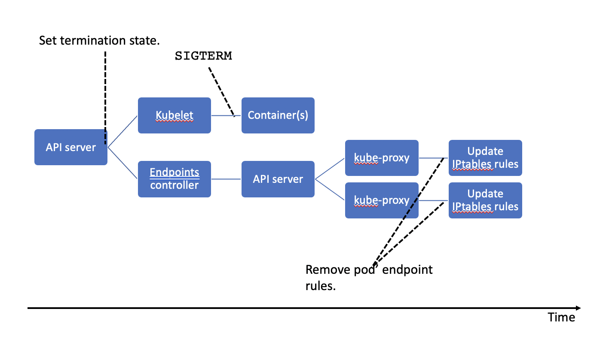
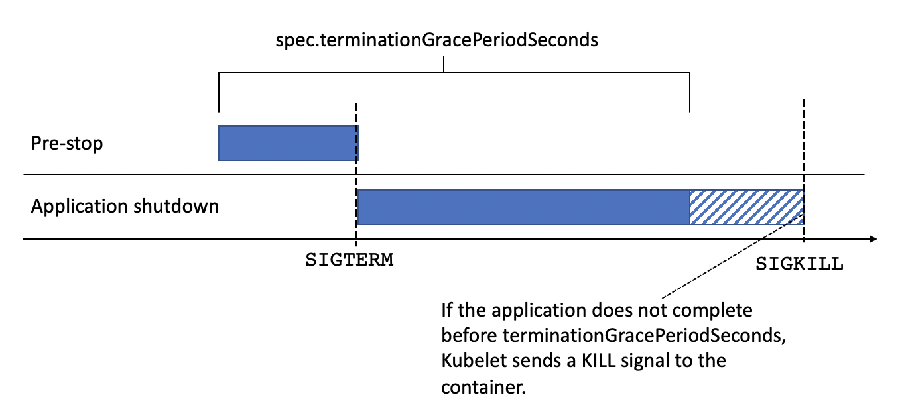

*[Photo by Kammeran Gonzalez-Keola](https://www.pexels.com/@kammeran-gonzalez-keola-3137381) used under [Pexels License](https://www.pexels.com/license/)*

At Rakuten, we generally use Kubernetes to run our services. Kubernetes enables us to operate robust systems at scale. However, Kubernetes is not perfect and in edge cases it may behave in unexpected ways. For example, during rolling deployments we expect no request failures --- a reasonable expectation, right? But when we ran functional tests during a deployment we noticed some requests failing --- to our surprise. After researching this for a while we learned that...

> Kubernetes will send traffic to terminating pods.

Even after starting the pod shutdown process, which includes sending a `TERM` signal to pods, Kubernetes still sends new requests to the pod. Because there is no orchestration between Kubernetes sending `TERM` signal and removing the pod from its service endpoint list. Those 2 operations can happen in any order, possibly with delay in between them. Yikes 😬.

In this article, we explore the Kubernetes pod eviction mechanism and show different approaches to avoid these surprising errors in apps deployed with Kubernetes.

## Kubernetes Pod Termination Process

A pod can be evicted for multiple reasons. For example, when a node is drained, via `kubectl delete`, or when the scheduler evicts pods to allow the execution of higher-priority ones. The eviction process starts when the API server modifies the state of a pod in `etcd` to the `Terminating` state. The node’s kubelet and the endpoints-controller are continuously watching the pod's state. Once they notice the termination state they start the eviction process:

1. Kubelet performs the pod eviction.
1. The endpoints-controller handles the endpoint removal process.

Both operations are asynchronous.



When kubelet acknowledges that a pod should be terminated, it initiates a shutdown sequence for each container in the pod. First, it runs [the container's pre-stop hook](https://kubernetes.io/docs/concepts/containers/container-lifecycle-hooks/#hook-handler-execution) (if it exists), then sends a `TERM` signal, and finally waits for the termination of the container. This sequential process should take less than 30 seconds (or the value in seconds specified in the [`spec.terminationGracePeriodSeconds`](https://kubernetes.io/docs/reference/generated/kubernetes-api/v1.21/#podspec-v1-core) field). If the container is still running beyond this time, kubelet waits for 2 more seconds, and then kills the container forcibly by sending a `KILL` signal.



In parallel, the endpoints-controller removes the pod's endpoint by requesting the API server. This server notifies all the kube-proxies on the worker nodes. Each kube-proxy removes the endpoint from the iptables rules in its node. Note that changes in the iptables do not affect already established connections.[^0]

[^0]: This limitation of iptables affects Kubernetes clusters using kube-proxy. Nowadays Kubernetes cluster operators have options other than kube-proxy & iptables: for example [cilium](https://cilium.io/blog/2019/08/20/cilium-16#kubeproxy-removal) or [calico](https://docs.projectcalico.org/about/about-ebpf) which use eBPF instead of iptables. We have not tested if eBPF CNI systems leave established connections untouched. But there is a [bug in Cilium](https://github.com/cilium/cilium/issues/14844) that causes existing connections to also fail during pod termination. So existing connections are likely to remain a challenge.

To achieve graceful shutdowns in pods, it is important to understand the asynchronous nature of the pod eviction process. We cannot make assumptions about which of the eviction processes will complete first. If the endpoint removal process finishes before the containers receive the `TERM` signal, no new requests will arrive while the containers are terminating. That's what we expect (or hope 😅). However, if the containers start terminating before the endpoint removal process is finished, the pods will continue to receive requests. In that case, clients will get "Connection timeout" or "Connection refused" errors as responses. Because the endpoint removal must propagate to every node in the cluster before it is complete, there is a high probability that the pod eviction process completes first. LearnK8s created a [neat visual representation of these two scenarios](https://learnk8s.io/a/graceful-shutdown-and-zero-downtime-deployments-in-kubernetes/graceful-shutdown.pdf).

Now that we understand the cause of the problem let's look at different solutions!

## Prerequisite: Handle `SIGTERM` correctly

First of all, we must make sure that the application terminates gracefully when the kubelet sends the `TERM` signal to the container.

> Your code should listen for this event and start shutting down cleanly at this point. This may include stopping any long-lived connections (like a database connection or WebSocket stream), saving the current state, or anything like that.
>
> **--- [Kubernetes best practices: terminating with grace](https://cloud.google.com/blog/products/containers-kubernetes/kubernetes-best-practices-terminating-with-grace)**

Fortunately, web application frameworks often support graceful shutdown with little or no configuration. For example, Spring Boot requires [just 2 lines of configuration](https://docs.spring.io/spring-boot/docs/current/reference/html/features.html#features.graceful-shutdown) and Express.js apps need [3 lines of JavaScript code](https://expressjs.com/en/advanced/healthcheck-graceful-shutdown.html).

Next, you should double-check that your application is actually receiving the `TERM` signal --- it might not! For example, the busybox `sh` that comes with Linux Alpine does not pass signals to children. We need a more capable shell (e.g. `bash`) or an init system can handle and forward signals.

Moreover, we don't control how off-the-shelf software reacts to a `TERM` signal. For example, HAproxy performs a hard stop when it receives the `TERM` signal and terminates gracefully when it receives the `USR1` signal. So we need to re-map the signal we receive from Kubernetes (`TERM`) to the signal that HAproxy "understands" (`USR1`). In the following example, we use `dumb-init` to handle signals, convert the `TERM` (`15`) to `USR1` (`10`) by using the `—-rewrite` option and send the signal to HAproxy.

```Dockerfile
ROM alpine:3.5
 
RUN apk add --no-cache bash

# Install haproxy
apk add haproxy=2.0.14-r0 

# Download dumb-init
ADD https://github.com/Yelp/dumb-init/releases/download/v1.2.0/dumb-init_1.2.0_amd64 /usr/local/bin/dumb-init
RUN chmod +x /usr/local/bin/dumb-init
 
# Run dumb-init with the signal rewrite definitons and haproxy as child process
CMD ["/usr/local/bin/dumb-init","--rewrite","15:10","haproxy","-f","config.cfg"]
```

## Idea #1: Sleep in the pre-stop hook

A common mitigation is to pause the pod eviction process in order to wait for the endpoint removal process to propagate throughout the Kubernetes cluster. After all, not only kube-proxies must be notified, but also other components such as ingress controllers and load balancers. To do that, we can use two settings in the [pod spec](https://kubernetes.io/docs/reference/generated/kubernetes-api/v1.21/#podspec-v1-core): `spec.lifecycle.preStop` and `spec.terminationGracePeriodSeconds`.

As described above, the pre-stop hook executes before containers receive the `TERM` signal, so we can use it to achieve a graceful shutdown.
To mitigate the problem, we add a `sleep` command in the pre-stop hook.
This will delay the `TERM` signal and create time for the endpoint removal to propagate.

### How long should I wait in the pre-stop hook?

It depends on the latency of your network and the nodes. You may need to perform some tests to find out this value. However, multiple sources suggest a value between 5-10 seconds should be enough for most cases.

Next, `spec.terminationGracePeriodSeconds` is the time limit that kubelet will wait before killing the container forcibly. The termination grace period starts from the execution of the pre-stop hook. Again there is no universally correct length for the grace period, you must calculate the value for `spec.terminationGracePeriodSeconds` based on your cluster and application behavior. It should include the sleep time in the pre-stop hook and the termination time of your application.

For example a 20 second delay with up to 40 seconds of application shutdown time results in the following config:

```yaml
spec:
  terminationGracePeriodSeconds: 60
  containers:
  - name: "{{APP_NAME}}"
    lifecycle:
      preStop:
        exec:
          command: ["/bin/sh","-c","sleep 20"]
```

An important note about long-lived TCP connections: the endpoint eviction does not affect established connections. So either you need a long enough `spec.terminationGracePeriodSeconds` to terminate long-lived connections, or you need to ensure that connections are short-lived.

### Sleep in the pre-stop hook - Trade-Offs

Sleeping in the pre-stop is a trick to avoid a problem that will (hopefully) be solved in the future. However, the pre-stop hook is not intended for this purpose, abusing the hook may make the deployment fail in future Kubernetes releases.

Moreover, this approach requires guesswork. If we sleep too long deployments become unnecessarily slow, if we don't sleep long enough we don't resolve the problem.

On the other hand, this requires only changes in our Kubernetes deployment yaml files, the application code stays untouched. So if this stops working in a future Kubernetes release we can update our Kubernetes config files without building new container images --- so it all stays on the Kubernetes config layer.

Another positive aspect is that the configuration is spatially close, right next to each other in the config file. In other words, it has high spatial cohesion, which improves readability & maintainability.

## Idea #2: Delay app shutdown

Instead of sleeping in the pre-stop hook, we can wait in the application for some time until (hopefully) no more requests come in. Application frameworks and runtimes expose hooks to receive & handle process signals[^1], for example in [Express.js](https://expressjs.com/en/advanced/healthcheck-graceful-shutdown.html) applications:

[^1]: Notably [Spring Boot](https://docs.spring.io/spring-boot/docs/current/reference/html/spring-boot-features.html#boot-features-graceful-shutdown) does not provide a straightforward hook to achieve that. Spring only exposes abstractions over the unix process signals like servlet context shutdown events.

```javascript
const server = app.listen(port)

process.on('SIGTERM', () => {
  debug('SIGTERM signal received: closing HTTP server in 10 seconds')
  
  const closeServer = () => server.close()
  setTimeout(closeServer, 10_000)
})
```

For off-the-shelf software we can wrap the application in a `launcher.sh` shell script, continuing the HAProxy example from above:

```shell
#!/bin/bash

HAPROXY_PID=-1

# wait for 10 seconds, then send a USR1 signal to HAproxy
kill_haproxy(){
  sleep 10
  kill -USR1 $HAPROXY_PID
}
 
# invoke kill_haproxy function when receives the TERM signal
trap kill_haproxy SIGTERM

# Support the user hitting Ctrl-C, but only in interactive shells
if [[ -t 1 ]] ; then
  trap 'kill -USR1 "$HAPROXY_PID"' SIGINT
fi
 
haproxy -f config.cfg & HAPROXY_PID=$!
 
if [ -z "$HAPROXY_PID" ]
then
  echo "haproxy: Haproxy failed to start"
else
  echo "haproxy: haproxy started"
fi
```

And use this script in the `Dockerfile`[^2]

[^2]: We don't use signal re-mapping through the init system in this example, instead we map signals explicitly in the shell script's trap. Moreover we use `tini` as init system, because installation as alpine package is a little neater than doing the manual download of `dumb-init`.

```Dockerfile
FROM alpine:3.5

# install bash, tini and haproxy
RUN apk add --no-cache bash tini haproxy=2.0.14-r0
 
# Run tini
ENTRYPOINT ["/usr/local/bin/tini", "—"]
CMD ["/launcher.sh"]
```

This mitigation mechanism is based on the same underlying idea of waiting with the hope that, eventually, Kubernetes will not route new requests to the pod. The only difference is where this delay happens: in idea #1 it is in a Kubernetes pod lifecycle hook, in idea #2 it is in the application container. So really, it's just 2 different implementations of the same idea.

Therefore the same considerations about estimating the "right" delay time & grace period apply. There is no guarantee that the endpoint eviction will complete before waiting for some seconds. So you need to analyze the latencies in your infrastructure and your application to determine the "right" waiting values. Remember that endpoint eviction does not affect established connections, so either you need a long enough `spec.terminationGracePeriodSeconds` to terminate long-lived connections or you need to ensure that connections are short-lived.

### Delay app shutdown - Trade-Offs

This approach modifies the application binary (the container image), so it can work on other orchestration systems (except for the `spec.terminationGracePeriodSeconds`). For us, that is a future, possible benefit, not an actual advantage that we utilize right now.

However it has drawbacks, firstly it forces us to forego graceful shutdown behavior that is built into application frameworks like [Spring Boot](https://docs.spring.io/spring-boot/docs/current/reference/html/spring-boot-features.html#boot-features-graceful-shutdown).

Secondly, it suffers from low spatial cohesion - the delay timing is now encoded in the application source code, while the upper bound (`spec.terminationGracePeriodSeconds`) is in the Kubernetes object description. This makes the approach less readably (or understandable) because you have to look at 2 different files, possibly in 2 different code repositories, to understand the full picture. It also makes it harder to maintain, because you have to orchestrate application changes (delay timing) with configuration changes (`spec.terminationGracePeriodSeconds`).

## Idea #3: _Dynamically_ delay app shutdown

In internal discussions we outlined a 3rd approach that seems more robust than the others, but complicates the application:

1. Run pod health checks every second
1. Don’t sleep on pre-stop hook
1. When the pod receives a `TERM` signal, start a stopwatch on the application layer.
1. Reset the stopwatch to zero every time the pod receives a request. It means we’re still getting traffic and we should be getting health check traffic as well.
1. When the stopwatch reaches `N` seconds, in other words `N` seconds without traffic, **AND** all connections are drained, we can kill the pod.

This may or may not work, depending on when Kubernetes decides to stop sending health checks. We did not try this approach because it is a lot more complicated than a sleep and we can accept slower deployments. But, _in theory_, it is more reliable than ideas #1 and #2.

## Conclusion

In summary, we described the Kubernetes pod termination process, give recommendations on how to cleanly handle the `TERM` signal in different scenarios. Finally, we describe several techniques that allow us to avoid failures during Kubernetes pod eviction, e.g. during rolling deployments. None of the techniques are perfect, idea #1 & #2 require magic numbers which rely on the latencies in your infrastructure, your application shutdown and the long-(/short)-lived-ness of connections. But we have successfully used these mitigations in production services with 0% error rate during deployments[^3]. Idea #3 is just that - an idea. We have not implemented it, so your mileage may vary.

[^3]: This is all based on Kubernetes clusters using kube-proxy & iptables. Kubernetes is moving towards [CNI implementations that use eBPF instead of iptables](https://archive.fosdem.org/2020/schedule/event/replacing_iptables_with_ebpf/). But the behavior described here also applies to those eBPF based solutions (or at least seems to apply to it) and there may be more caveats that you have to keep in mind. For instance, Cilium seems to have a [bug](https://github.com/cilium/cilium/issues/14844) that causes existing connections to also fail during pod termination, making graceful shutdown harder.
